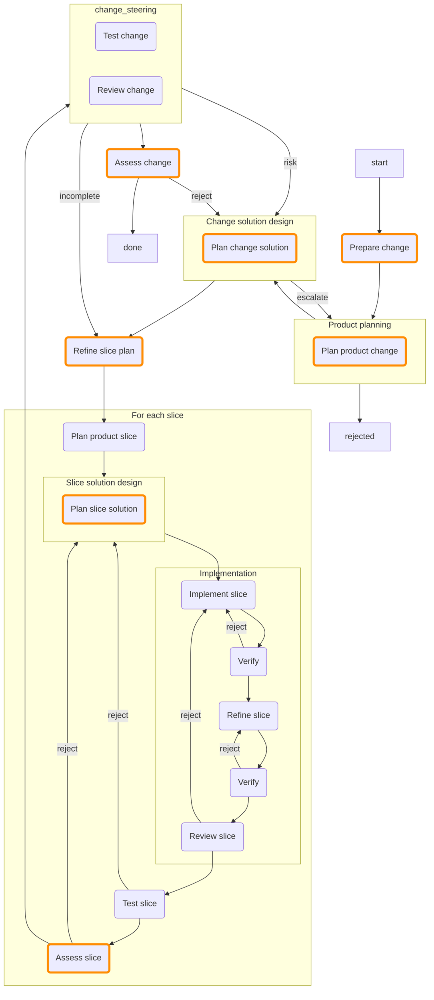

```mermaid
flowchart TB
    start --> prepare_change
    prepare_change(Prepare change) --> product_planning
    
    subgraph product_planning [Product planning]
        plan_product_change(Plan product change)
    end
    product_planning --> change_design
    product_planning --> rejected
    
    subgraph change_design [Change solution design]
        plan_change_solution(Plan change solution)
    end
    change_design --> |escalate| product_planning
    change_design --> slicing
    
    slicing(Refine slice plan) --> plan_product_slice
    
    subgraph change_slice [For each slice]
        plan_product_slice(Plan product slice) --> slice_design

        subgraph slice_design [Slice solution design]
            plan_slice_solution(Plan slice solution)
        end
        slice_design --> implement

        subgraph implementation [Implementation]
            implement(Implement slice) --> verify_implement
            verify_implement(Verify) --> refine
            verify_implement --> |reject| implement
            refine(Refine slice) --> verify_refine
            verify_refine(Verify) --> review
            verify_refine --> |reject| refine
            review(Review slice) --> |reject| implement
        end
        review --> test_slice
        
        test_slice(Test slice) --> assess_slice
        test_slice --> |reject| slice_design
        assess_slice( Assess slice)
        assess_slice --> |reject| slice_design
    end
    assess_slice --> change_steering
    
    subgraph change_steering
        test_change(Test change)
        review_change(Review change)
    end
    change_steering(Change steering) --> assess_change
    change_steering --> |incomplete| slicing
    change_steering --> |risk| change_design
    
    assess_change( Assess change) --> done
    assess_change --> |reject| change_design
    done
    
    classDef human_in_the_loop stroke:#ff8c00,stroke-width:4px;
    class prepare_change,plan_change_solution,slicing,plan_slice_solution,assess_slice,assess_change,plan_product_change human_in_the_loop
```
