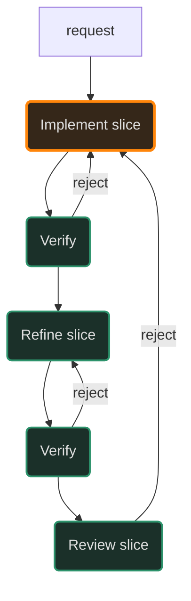

# Implementer

```mermaid
flowchart TB
    request --> implement
    implement(Implement slice):::primary_agent --> verify_implement
    verify_implement(Verify):::sub_agent --> refine
    verify_implement --> |reject| implement
    refine(Refine slice):::sub_agent --> verify_refine
    verify_refine(Verify):::sub_agent --> review
    verify_refine --> |reject| refine
    review(Review slice):::sub_agent --> |reject| implement

    class , requester
    class , primary_agent
    class , sub_agent
    class , collaborative_step
    class , autonomous_step
    class , subprocess

    classDef requester fill:#301B22,stroke:#B83A48,stroke-width:4px,color:#E0E0E0
    classDef primary_agent fill:#352719,stroke:#FF850A,stroke-width:3px,color:#E0E0E0
    classDef sub_agent fill:#1B3029,stroke:#2D936C,stroke-width:2px,color:#E0E0E0
    classDef collaborative_step fill:#261D16,stroke:#C99052,color:#E0E0E0
    classDef autonomous_step fill:#17251F,stroke:#68A88D,color:#E0E0E0
    classDef subprocess stroke-width:4px,stroke-dasharray:7 4
```